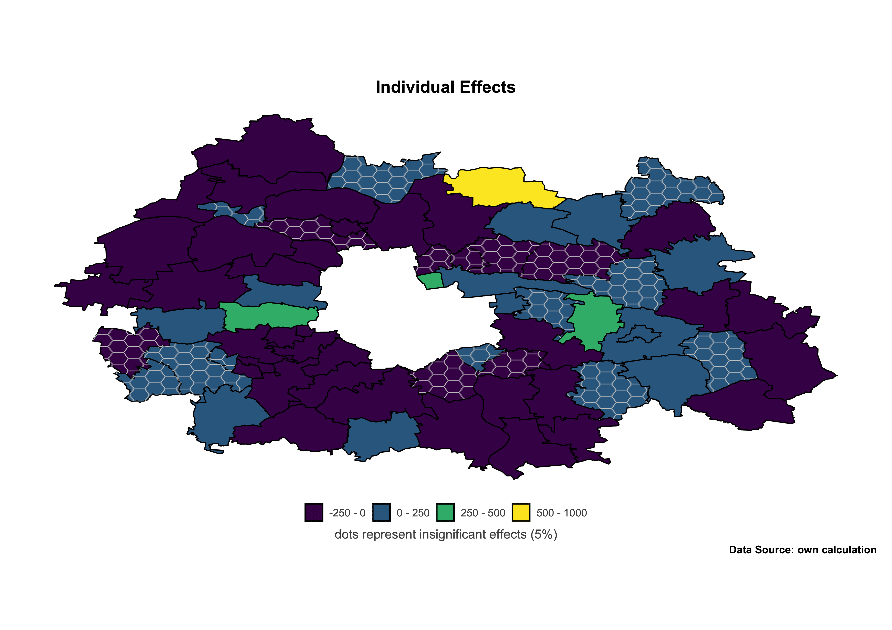

```{r setup, include=FALSE}
knitr::opts_chunk$set(echo = TRUE, warning = F, message = F)
```

```{r packages, include=TRUE, echo=FALSE}
# 0. Initial set-up
{
  # 0.1. clear env
rm(list = ls())

  # 0.2. load packages
requiredPackages <- c('tidyverse', 'haven', 'readxl', 'utf8', 'rjson', 'osmdata', 'sf', 'sp', 'broom', 'viridis', 'cowplot', 'reshape2', 'spatialreg', 'spdep', 'plm', 'splm', 'Metrics', 'stargazer', 'kableExtra', 'dplyr')
for (i in requiredPackages) {
  if (!require(i,character.only = T)) {
    install.packages(i, character.only = T)
  }
}

  # 0.3. define custom functions
r2 <- function (actual, res) {
  rss <- sum(res^2)
  tss <- sum((actual - mean(actual)) ^ 2)
  r2 <- 1 - rss/tss
  return (r2)
}

r2_adj <- function (actual, res, p = 29) {
  n <- 759
  r2_adj <- 1 - ((1 - r2(actual, res)) * (n - 1) / (n - p - 1))
  return (r2_adj)
}

rmse <- function (res) {
  return (sqrt(sum(res^2)/759))
}

# https://stackoverflow.com/questions/46186527/how-to-calculate-bic-and-aic-for-a-gmm-model-in-r-using-plm
AIC_adj <- function(mod, p){
  # Number of observations
  n.N   <- nrow(mod$model)
  # Residuals vector
  u.hat <- residuals(mod)
  # Variance estimation
  s.sq  <- log( (sum(u.hat^2)/(n.N)))
  # Number of parameters (incl. constant) + one additional for variance estimation
  p     <-  p
  
  # Note: minus sign cancels in log likelihood
  aic <- 2*p  +  n.N * (  log(2*pi) + s.sq  + 1 ) 
  
  return(aic)
}
}
```

### Introduction

In this study, we examine part of the dataset from the paper "Causes of the spatially uneven outflow of Warsaw inhabitants to the city’s suburbs: an economic analysis of the problem” (@Bogusz2021), the reviewed version of which was submitted to the Central Eastern Economic Journal. In it, I investigate the suburban migration patterns of Warsaw inhabitants (the outflow from inner city to suburban boroughs) and aim to identify the features of boroughs which are key pulling factors for migrants. I built a correlated random effects panel model with Mundlak device. I estimated the extended gravity model of migration equation by feasible GLS, incorporating Mundlak style time averages of variables which might be correlated with transient errors. That kind of specification allowed me to overcome problems of possible endogeneity, as well as transient errors collinearity. My work on this topic also included  parsing unyielding data from Polish county offices. These data contains each property market transaction from 2008-2019, based on which I wanted to calculate the average price of housing on a borough level. This variable can be, however, the source of endogeneity in the model. 

This topic is relevant, as when those pulling and pushing factors are identified, adequate spatial planning can be executed in order to curb negative consequences of unrestricted urban sprawl. The panel model in my article is based on the extended gravity model of migration.

However, one caveat remains and it is addressed in this assignment. Namely, the suburban boroughs are spatial entities and can, thus, interact with each other to some extent. It is reasonable to assume that spatial autocorrelation might be present in the model. That is why it is feasible to try modeling suburban migration with a spatial approach - in our case, with the spatial lag model.

A thorough literature review of the topic can be found in one of the working papers:

(1) https://www.wne.uw.edu.pl/files/1216/0224/3666/WNE_WP340.pdf

(2) https://www.wne.uw.edu.pl/files/7816/1193/3036/WNE_WP349.pdf 

In this assignment, we focus on (1) visualisation of spatial data; (2) spatial panel modeling.

### Exploratory Data Analysis

We conduct a spatial panel analysis of migration from Warsaw to 69 suburban boroughs in between 2009 and 2019. The dependent variable is the number of migrants who moved out of Warsaw and reported residence in a borough. Below, we describe the dataset and visualise the data that we have at our disposal.

#### {.tabset .tabset-fade}

##### Variables

The regressors used in the analysis are.

1. Population density - one of the key variables of the gravity model of migration.

2. Distance (straight line) - the second key variable of the gravity model of migration.

3. Relative income per capita - average income in a borough (in PLN) divided by the average income in all boroughs weighted by population (in PLN). Calculated based on personal income tax data.

4. Unemployment rate - measures local labor market condition.

5. Total greenery spaces (parks, green plazas, urban forests, etc.) - an amenity.

6. Ratio of the forest area and the total area of a borough - measures to what extend the presence of forests hinders habitable zones (e.g. it is forbidden to settle in close proximity to the Kampinowski National Park).

7. Number of kindergartens per 100 000 population - an amenity.

8. Mean price of m2 of housing in a borough divided by the same for Warsaw - a relative measure of the prices of housing is constructed. Below, I include a brief summary from my article "Causes of the spatially uneven outflow of Warsaw inhabitants to the city’s suburbs: an economic analysis of the problem” about how the price indicator was constructed based on the transactional data obtained from Polish county offices.

9. Borough type, according to the polish administrative classification. Possible types are urban, urban-rural, and rural.

10. Presence of suburban train station - a dummy indicating if there is a train station in a borough.

Below a disclaimer from @Bogusz2021 about how the relative price of housing was calculated:

*Information about prices of housing available at the Polish Statistical Office are limited to the county level in years 2015-2018, which is a very rough measure for prices in boroughs. In my attempt to find a better one, I obtained real estate transactional data from Polish county offices for each of the 69 boroughs in the years 2008-2019 for the following property types: flats, houses, and parcels. Based on that parsed data, I constructed an indicator of the relative price of housing. I included observations for each borough, type, and year where the number of transactions was greater than 10. The average price of m2 of housing was obtained by weighting average prices of property types (in each borough and each year) by the number of transactions corresponding to different types. However, in terms of flats, the price is related to the living space, while it corresponds to the area of a parcel for both house and parcel. This is due to the reason that no information about the living space of houses was available for about half of the boroughs in my study. The availability of details of transactions depends on the data classifying and storing system a specific county office uses and there is no standardization of such a system in Poland. In addition, I limited the area of parcels to observations greater than 200 m2 and smaller than 2000 m2. The reason for this distinction is that properties classified as houses or parcels are not necessarily lots habitable by private agents, but can be also service establishments. On the one hand, 200 m2 is the minimum parcel size, where a habitable house, rather than holiday cabin can be built. On the other, 2000 m2 is a reasonable upper boundary since private houses are rarely built on larger parcels in the suburbs of Warsaw (the average parcel size is between 1400-2000 in 90% of the boroughs in years examined) giving rise to the presumption that larger parcels function as service establishments in the vast majority.That obtained average price was divided by the average price in Warsaw as obtained from the Polish Statistical Office for 2015-2018 and extrapolated for 2008-2019 by the use of the index of prices of housing for Warsaw for 2008-2019. Hence, a price relative to the one in Warsaw was constructed. Furthermore, no transactions were observed for all types or at all for some boroughs in some years. To complete the unbalanced panel, the well-known multiple imputation technique was used. Since in my setting observations for only one regressor were missing, predictive mean matching was applied. When imputing the missing values of a continuous variable, PMM may be preferable to linear regression when the normality of the underlying model is suspect (Little, 1988; Rubin, 1986). The imputation was made before calculating the time average or price relative to the price in Warsaw.* (@Bogusz2021)

The table below presents variable names, units, and sources.

```{r}
names <- c("check_in", "pop_density", "dist", "income", "unempl", "greenery", "forest", "average_b_waw", "bu", "bur", "train")
units <- c("people", "people/km2", "km", "ratio", "rate", "ha", "ratio", "ratio", "binary", "binary", "binary")
sources <- c("Polish Statistical Office","Polish Statistical Office","Polish Statistical Office","Polish Statistical Office","Polish Statistical Office","Polish Statistical Office","Polish Statistical Office","Suburban County Offices","Polish Statistical Office","Polish Statistical Office","Polish Statistical Office")
df <- data.frame(names, units, sources)
colnames(df) <- c("Variable Name", "Unit", "Source")
df %>%
  kbl() %>%
  kable_styling(bootstrap_options = c("striped", "responsive", "hover")) %>%
  scroll_box(width = "100%")
```

The below map shows the administrative division of the suburban ring of Warsaw, i.e. where are respective boroughs located.

```{r plots1, include=TRUE, eval=FALSE}
  # 1. plot of boroughs with names
{
  # 1.1. preapre data with polygons' centroids to add labels to map
  locs_cent_sp <- st_transform(locs$osm_multipolygon, crs = 2180) %>%
    st_geometry() %>%
    st_centroid() %>%
    st_transform(., crs ="+proj=longlat +datum=WGS84") %>%
    as(., 'Spatial') %>%
    as.data.frame() %>%
    mutate (
      borough = locs$osm_multipolygons$borough,
      x = as.numeric(coords.x1),
      y = as.numeric(coords.x2)
    ) %>%
    dplyr::select(borough, x, y)
  
  # 1.2. for some boroughs, numbers will be used instead of names (for readability purposes)
  boroughs_numbers <- c('Nowy Dwór Mazowiecki', 'Piastów', 'Podkowa Leśna', 'Milanówek', 'Mińsk Mazowiecki', 'Mińsk Mazowiecki 2', 'Legionowo', 'Pruszków', 'Sulejówek')
  
  # 1.3. filter for boroughs where numbers will be shown
  locs_cent_sp_number <- locs_cent_sp[locs_cent_sp$borough %in% boroughs_numbers, ] %>%
    arrange(borough)
  
  # 1.4. add unique numbers to borough
  locs_cent_sp_number$number <- 1:nrow(locs_cent_sp_number)
  
  # 1.5. filter for boroughs where names will be shown
  locs_cent_sp_name <- locs_cent_sp[!locs_cent_sp$borough %in% boroughs_numbers, ]
  
  # 1.6. create data frame to add the names of borough denoted with numbers
  (max(locs_cent_sp_name$y) - min(locs_cent_sp_name$y)) / 9 # -0.0706
  
  map_legend <- data.frame(
    number = locs_cent_sp_number$number,
    borough = locs_cent_sp_number$borough,
    x = max(locs_cent_sp_name$x) + 0.15,
    y = seq(max(locs_cent_sp_name$y), min(locs_cent_sp_name$y), -0.0709)
  )
  
  # 1.7. add enters to names that have more than one word (for readability purposes)
  for (i in (1:nrow(locs_cent_sp_name))) {
    name <- locs_cent_sp_name[i, 'borough']
    if (grepl(' ', name) ||  grepl('-', name)) {
      name <- ifelse(grepl(' ', name), strsplit(name, ' '), strsplit(name, '-'))[[1]]
      name <- paste(name,  collapse = '\n')
      locs_cent_sp_name[i, 'borough'] <- name
    }
  }
    # 1.8. manually adjust locations to better fit the name
  locs_cent_sp_name[locs_cent_sp_name$borough == 'Lesznowola', 'y'] <- locs_cent_sp_name[locs_cent_sp_name$borough == 'Lesznowola', 'y'] + 0.01
  locs_cent_sp_name[locs_cent_sp_name$borough == 'Ożarów\nMazowiecki', 'y'] <- locs_cent_sp_name[locs_cent_sp_name$borough == 'Ożarów\nMazowiecki', 'y'] + 0.005
  locs_cent_sp_name[locs_cent_sp_name$borough == 'Wiązowna', 'y'] <- locs_cent_sp_name[locs_cent_sp_name$borough == 'Wiązowna', 'y'] + 0.01
  locs_cent_sp_name[locs_cent_sp_name$borough == 'Wiązowna', 'x'] <- locs_cent_sp_name[locs_cent_sp_name$borough == 'Wiązowna', 'x'] - 0.01
  locs_cent_sp_name[locs_cent_sp_name$borough == 'Celestynów', 'x'] <- locs_cent_sp_name[locs_cent_sp_name$borough == 'Celestynów', 'x'] - 0.01
  locs_cent_sp_name[locs_cent_sp_name$borough == 'Pomiechówek', 'x'] <- locs_cent_sp_name[locs_cent_sp_name$borough == 'Pomiechówek', 'x'] - 0.01
  locs_cent_sp_name[locs_cent_sp_name$borough == 'Pomiechówek', 'y'] <- locs_cent_sp_name[locs_cent_sp_name$borough == 'Pomiechówek', 'y'] - 0.014
  locs_cent_sp_number[locs_cent_sp_number$borough == 'Mińsk Mazowiecki 2', 'y'] <- locs_cent_sp_number[locs_cent_sp_number$borough == 'Mińsk Mazowiecki 2', 'y'] - 0.01
  locs_cent_sp_number[locs_cent_sp_number$borough == 'Mińsk Mazowiecki 2', 'x'] <- locs_cent_sp_number[locs_cent_sp_number$borough == 'Mińsk Mazowiecki 2', 'x'] + 0.045
  locs_cent_sp_number[locs_cent_sp_number$borough == 'Mińsk Mazowiecki 1', 'y'] <- locs_cent_sp_number[locs_cent_sp_number$borough == 'Mińsk Mazowiecki 1', 'y'] + 0.005
  locs_cent_sp_number[locs_cent_sp_number$borough == 'Nowy Dwór Mazowiecki', 'y'] <- locs_cent_sp_number[locs_cent_sp_number$borough == 'Nowy Dwór Mazowiecki', 'y'] - 0.011
  locs_cent_sp_number[locs_cent_sp_number$borough == 'Nowy Dwór Mazowiecki', 'x'] <- locs_cent_sp_number[locs_cent_sp_number$borough == 'Nowy Dwór Mazowiecki', 'x'] + 0.02
  locs_cent_sp_number[locs_cent_sp_number$borough == 'Podkowa Leśna', 'y'] <- locs_cent_sp_number[locs_cent_sp_number$borough == 'Podkowa Leśna', 'y'] - 0.007
  locs_cent_sp_number[locs_cent_sp_number$borough == 'Podkowa Leśna', 'x'] <- locs_cent_sp_number[locs_cent_sp_number$borough == 'Podkowa Leśna', 'x'] + 0.018
  
  # 1.9. plot
  map_names <- ggplot(locs_sp, aes(x=long, y=lat, group=group)) +
    # borough outlines and fill
    geom_polygon(color = 'black', fill = '#f9f9f9', size=1) +
    # number labels on the map
    geom_label(
      data = locs_cent_sp_number,
      mapping = aes(x=x, y=y, label = number),
      size = 2.5,
      color = 'black',
      fontface = 'bold',
      inherit.aes = F) +
    # number labels on the legend
    geom_label(
      data = map_legend,
      mapping = aes(x=x, y=y, label = number),
      size = 2.5,
      color = 'black',
      fontface = 'bold',
      inherit.aes = F) +
    # text labels on the legend
    geom_text(
      data = map_legend,
      mapping = aes(x=x + 0.03, y=y, label = borough),
      size = 2.5,
      color = 'black',
      fontface = 'bold',
      hjust = 0,
      inherit.aes = F) +
    # empty points to fit the legend's text labels
    geom_point(
      data = map_legend,
      mapping = aes(x=x + 0.15, y=y),
      size = 0,
      color = NA,
      inherit.aes = F) +
    # text labels on the map
    geom_text(
      data = locs_cent_sp_name,
      mapping = aes(x=x, y=y, label = borough),
      size = 2,
      color = 'black',
      fontface = 'bold',
      angle = 20,
      inherit.aes = F) +
    coord_fixed() +
    theme_void()
  
  # 3.1.10. save plot
  png('img/map_names.png', width = 3508, height = 1700, res=300)
  map_names
  dev.off()
}
```


##### Visualisation 1

We start the analysis by examining the distribution of the dependent variable, and the key variables of the gravity model of migration, as well as relative income per capita, in boroughs in 2008 and 2018 (start and end of the analysis). I look also at income, because, according to the existing literature on suburbanisation, it is supposed to have great positive influence on the number of suburban migrants (@Mieszkowski1993).

```{r plots2, include=TRUE, eval=FALSE}
  # 2. variable levels plots

  # 2.1.  define plot function
plt_metric <- function (var, year, title, caption, legend, breaks) {
  var <- enquo(var)
  ggplot() +
    geom_polygon(data = locs_sp[locs_sp$year == year,], aes(x=long, y=lat, group=group, fill=!!var), colour='black', size=0.5, alpha=0.9) +
    coord_sf() +
    scale_fill_viridis(trans = "log1p",
                       breaks = breaks, labels = breaks
    ) +
    labs(
      caption = caption,
      title = title,
      fill = legend
    ) +
    theme_void() +
    theme(
      panel.grid.major = element_blank(),
      panel.grid.minor = element_blank(),
      panel.border = element_blank(),
      plot.background = element_blank(),
      plot.title = element_text(color="#000000", face="bold", size=16, hjust=0),
      plot.caption = element_text(color="#000000", face="bold", size=10, hjust=1),
      plot.margin = unit(c(0.5,0.5,0.5,0.5), "cm"),
      strip.text.x = element_text(color="#505050", face="bold", size=12, hjust=0.5),
      legend.title = element_text(color="#505050", face="bold", size=12, hjust=1),
      legend.text = element_text(color="#505050", size=10, angle = 0),
      legend.position = 'bottom'
    ) +
    guides(
      fill = guide_colourbar(
        ticks.colour = "white",
        ticks.linewidth = 1.2,
        barwidth=15,
        label.position="bottom"))
}

  # 2.2. define plot function to compare 2 years
plt_compare <- function (var, year1, year2, title, caption, legend, breaks) {
  var <- enquo(var)
  ggplot() +
    geom_polygon(data = locs_sp[locs_sp$year %in% c(year1, year2),], aes(x=long, y=lat, group=group, fill=!!var), colour='black', size=0.5, alpha=0.9) +
    coord_sf() +
    facet_wrap(~year) +
    scale_fill_viridis(trans = "log1p",
                       breaks = breaks, labels = breaks
    ) +
    labs(
      caption = caption,
      title = title,
      fill = legend
    ) +
    theme_void() +
    theme(
      panel.grid.major = element_blank(),
      panel.grid.minor = element_blank(),
      panel.border = element_blank(),
      plot.background = element_blank(),
      plot.title = element_text(color="#000000", face="bold", size=16, hjust=0),
      plot.caption = element_text(color="#000000", face="bold", size=10, hjust=1),
      plot.margin = unit(c(0.5,0.5,0.5,0.5), "cm"),
      strip.text.x = element_text(color="#505050", face="bold", size=12, hjust=0.5),
      legend.title = element_text(color="#505050", face="bold", size=12, hjust=1),
      legend.text = element_text(color="#505050", size=10, angle = 0),
      legend.position = 'bottom'
    ) +
    guides(
      fill = guide_colourbar(
        ticks.colour = "white",
        ticks.linewidth = 1.2,
        barwidth=15,
        label.position="bottom"))
}

  # 2.3. plot bu/bur/br
plt_bu_bur_bu <- locs_sp %>%
  mutate(
    b = case_when(
      bu == '1' ~ 'urban',
      bur == '1' ~ 'urban-rural',
      T ~ 'rural'
    )) %>%
  filter(
    year == 2018
  ) %>%
  ggplot() +
  geom_polygon(aes(x=long, y=lat, group=group, fill=b), colour='black', size=0.5, alpha=0.9) +
  coord_sf() +
  scale_fill_viridis(discrete=T) +
  labs(
    caption = 'Data Source: Polish Statistical Office',
    title = 'a) type of borough',
    fill = 'type'
  ) +
  theme_void() +
  theme(
    panel.grid.major = element_blank(),
    panel.grid.minor = element_blank(),
    panel.border = element_blank(),
    plot.background = element_blank(),
    plot.title = element_text(color="#000000", face="bold", size=16, hjust=0),
    plot.caption = element_text(color="#000000", face="bold", size=10, hjust=1),
    plot.margin = unit(c(0.5,0.5,0.5,0.5), "cm"),
    strip.text.x = element_text(color="#505050", face="bold", size=12, hjust=0.5),
    legend.title = element_text(color="#505050", face="bold", size=12, hjust=1),
    legend.text = element_text(color="#505050", size=10, angle = 0),
    legend.position = 'bottom'
  )

  # 2.4. plots for time-invariant variables
plt_dist <- plt_metric(dist, 2018, 'c) distance', 'Data Source: Google Maps', 'km', c(10, 12, 15, 20, 25, 30, 40, 50))

plt_train <- locs_sp %>%
  mutate(
    train = case_when(
      train == '1' ~ 'presence of suburban train station',
      T ~ 'lack of suburban train station'
    )) %>%
  filter(
    year == 2018
  ) %>%
  ggplot() +
  geom_polygon(aes(x=long, y=lat, group=group, fill=train), colour='black', size=0.5, alpha=0.9) +
  coord_sf() +
  scale_fill_viridis(discrete=T) +
  labs(
    caption = 'Data Source: Google Maps',
    title = 'b) suburban train station',
    fill = ''
  ) +
  theme_void() +
  theme(
    panel.grid.major = element_blank(),
    panel.grid.minor = element_blank(),
    panel.border = element_blank(),
    plot.background = element_blank(),
    plot.title = element_text(color="#000000", face="bold", size=16, hjust=0),
    plot.caption = element_text(color="#000000", face="bold", size=10, hjust=1),
    plot.margin = unit(c(0.5,0.5,0.5,0.5), "cm"),
    strip.text.x = element_text(color="#505050", face="bold", size=12, hjust=0.5),
    legend.title = element_text(color="#505050", face="bold", size=12, hjust=1),
    legend.text = element_text(color="#505050", size=10, angle = 0),
    legend.position = 'bottom'
  )


  # 2.5. combined plot for all variables
plt_check_in <- plt_compare(check_in, 2008, 2018, 'd) migrants', 'Data Source: Polish Statistical Office', '# of migrants', c(1, 2, 5, 10, 25, 50, 100, 250, 750))

plt_income <- plt_compare(income, 2008, 2018, 'e) income per capita', 'Data Source: own calculation based on data from Polish Statistical Office', 'ratio', c(0.3, 0.5, 0.75, 1, 1.5, 2, 2.5, 3))

plt_kinder <- plt_compare(kinder, 2008, 2018, 'f) number of kindergartens', 'Data Source: Polish Statistical Office', '# of kindergartens', c(1, 2, 5, 10, 25, 50, 75, 100))

plt_unempl <- plt_compare(unempl, 2008, 2018, 'g) unemployment rate', 'Data Source: Polish Statistical Office', 'ratio', seq(0, 0.1, 0.01))

plt_pop_density <- plt_compare(pop_density, 2008, 2018, 'h) population density', 'Data Source: Polish Statistical Office', '', c(0.5, 1, 2, 3, 5, 7, 10, 15, 20, 30)) +
  labs(fill = expression(bold(paste('# of people / ', km^2))))

plt_greenery <- plt_compare(greenery, 2008, 2018, 'i) area of green amenities (parks etc.)', 'Data Source: Polish Statistical Office', 'area in ha', c(2, 5, 10, 25, 50, 100, 250))

plt_average_b_waw <- plt_compare(average_b_waw, 2008, 2018, 'j) relative price of housing', 'Data Source: Polish Statistical Office & suburban county officies', 'ratio', c(0.01, 0.1, 0.2, 0.3, 0.4, 0.5, 0.6))


png('img/maps_combined.png', width = 3508, height = 2*2480, res=300)
plot_grid(plt_bu_bur_bu, plt_dist, plt_train, plt_check_in, plt_income, plt_kinder, plt_unempl, plt_pop_density, plt_greenery, plt_average_b_waw, ncol = 2, greedy=F)
dev.off()
```


Two things are visible on the above plots. First of all, that the levels of variables changed between the first and the last year in our analysis, e.g. the number of kindergartens per 100 000 people increased in all boroughs. Second, great disparities between boroughs are visible for most of the variables, e.g. in income per capita or area of green amenities.

##### Visualisation 2

We also happen to have the location data about roads and buildings in each of the boroughs in our analysis, that we scraped from the OSM for our Master thesis. Here, we exploit it for additional visual inspection of the degree of urbanisation of the suburban ring. However, these location data won't be used in our spatial models. Below, we plot the locations of roads and buildings for three representative boroughs: Pruszków, which is classified as type "urban", Konstancin-Jeziorna (type "urban-rural"), and Baranów (type "rural").

*These plots serve rather the purpose of presenting an interesting visualisation, than contributing to out spatial models.*

```{r plots3, include=TRUE, eval=FALSE}
  # 3. plot with highways and buildings
{
  # 3.1. large highway types
  hghws_tp_lrg <- c('motorway', 'trunk', 'primary', 'secondary', 'tertiary')
  
  # 3.2. select only large highways
  hghws_lrg <- hghws$osm_lines[hghws$osm_lines$highway %in% hghws_tp_lrg,]
  
  # 3.3. function to plot boroughs_osm
  plt_loc <- function(borough = 'all', l=T, b=T, h=T, hl=T) {
    # create spatial object for loc, bldgs, hghws based on selection go borough
    if (borough=='all') {
      locs_sp <- as(locs$osm_multipolygon, 'Spatial')
      bldgs_sp <- as(bldgs$osm_polygons, 'Spatial')
      hghws_sp <- as(hghws$osm_lines, 'Spatial')
      hghws_lrg_sp <- as(hghws_lrg, 'Spatial')
    } else if (class(borough) == 'character') {
      locs_sp <- as(locs$osm_multipolygon[locs$osm_multipolygon$borough %in% borough,], 'Spatial')
      bldgs_sp <- as(bldgs$osm_polygons[bldgs$osm_polygons$borough %in% borough,], 'Spatial')
      hghws_sp <- as(hghws$osm_lines[hghws$osm_lines$borough %in% borough,], 'Spatial')
      hghws_lrg_sp <- as(hghws_lrg[hghws_lrg$borough %in% borough,], 'Spatial')
    } else if (class(borough) == 'numeric') {
      locs_sp <- as(locs$osm_multipolygon[borough,], 'Spatial')
      bldgs_sp <- as(bldgs$osm_polygons[borough,], 'Spatial')
      hghws_sp <- as(hghws$osm_lines[borough,], 'Spatial')
      hghws_lrg_sp <- as(hghws_lrg[borough,], 'Spatial')
    }
    
    legend <- c()
    if (l) {legend <- append(legend, c('border' = 'black'))}
    if (b) {legend <- append(legend, c('building' = '#482677'))}
    if (hl) {legend <- append(legend, c('large road' = '#1F968B'))}
    if (h) {legend <- append(legend, c('road' = '#73D055'))}
    
    # plot
    p <- ggplot() +
      {if (h) geom_line(data = hghws_sp, aes(x=long, y=lat, group=group, colour = 'road'), size=0.2)} +
      {if (hl) geom_line(data = hghws_lrg_sp, aes(x=long, y=lat, group=group, colour = 'large road'), size=0.4)} +
      {if (b) geom_polygon(data = bldgs_sp, aes(x=long, y=lat, group=group, colour = 'building'), fill = '#482677', size=0)} +
      {if (l) geom_polygon(data = locs_sp, aes(x=long, y=lat, group=group, colour = 'border'), fill=NA, size=1)} +
      labs(
        title = borough,
        color = NULL) +
      scale_color_manual(values = legend) +
      theme_void() +
      coord_fixed() +
      theme(
        plot.title = element_text(color="#000000", face="bold", size=16, hjust=0.5),
        legend.position = 'bottom',
        legend.text = element_text(size=10)
      ) +
      guides(color = guide_legend(
        keyheight = 1, 
        keywidth = 1,
        override.aes = list(fill = legend)
      ))
    
    print(p)
    
    return(p)
  }
  
  # save plot for Pruszków
  png('img/map_pruszkow.png', width = 3508, height = 2000, res=300)
  plt_loc('Pruszków')
  dev.off()
  
  # save plot for Konstancin Jeziorna
  png('img/map_konstancin.png', width = 3508, height = 2000, res=300)
  plt_loc('Konstancin-Jeziorna')
  dev.off()
  
  # save plot for Jaktorów
  png('img/map_jaktorow.png', width = 3508, height = 2000, res=300)
  plt_loc('Jaktorów')
  dev.off()
}
```


It can be seen that the map for Pruszków is much denser than the map of Konstancin-Jeziorna, which, in turn, is much denser than the map for Jaktorów. As expected, the degree of urbanization varies between boroughs greatly and it is the highest for the urban borough and the lowest for the rural borough.

#### {-}

### Spatial Models

#### Data Preparation

Below we run the necessary data preparation before we can run the spatial models. It includes loading all necessary datasets, cleaning, and mergind them. Especially, we need to merge data from the Polish Statistical Office with OSM locations of boroughs.

```{r}
# 1. Since our code was deleted, we will be using the files that were saved during development, but the webscraping code is unavailable.
{
  # 1.1. file with dependent and independent variables in years 2008-2019 (only check_in is available for 2019)
data <- read.csv('data/data.csv', sep = ',')

  # 1.2. file with OSM IDs for all borough (was required for downloading the data from OSM and will be used to sort the observations)
boroughs_osm <- read.csv('data/boroughs_osm.csv', sep = ',')

  # 1.3. file with borough polygons (downloaded from OSM using osmdata package and transformed to correct CRS)
locs <- readRDS('data/locs.RDS')

  # 1.4. file with borough polygons joined with information from data file (locs + data)
locs_sp <- readRDS('data/locs_sp.RDS')

  # 1.5. file with buildings
# bldgs <- readRDS('data/bldgs.RDS')

  # 1.6 file with roads
# hghws <- readRDS('data/hghws.RDS')
}

# 2. Let's prepare data for modeling
{
  # 2.1. filter out 2019 since it only contains target variable
data_model <- data %>%
  filter(year != 2019)

  # 2.2. some variables do not change over time, and thus we should find only spatial lags for them
variables_constant <- c('bu', 'bur', 'br', 'dist', 'train')
    
  # 2.3. now let's select the variables that do change over time
variables_temporal <- c('check_in', 'income', 'kinder', 'unempl', 'pop_density', 'greenery', 'average_b_waw')

  # 2.4. convert binary variables to categorical
data_model <- data_model %>%
  mutate_at(c('bu', 'bur', 'br', 'train'), as.factor)

  # 2.4. add osm_id and select columns for modeling
data_model <- data_model %>%
  merge(boroughs_osm, by = 'borough') %>%
  dplyr::select(osm_id, year, variables_constant[variables_constant!='br'], all_of(variables_temporal)) %>%
  arrange(osm_id, year)

  # 2.5. create spatial weights matrix
locs$osm_multipolygons <- arrange(locs$osm_multipolygons, rownames(locs$osm_multipolygons))

cont.nb <- poly2nb(as(locs$osm_multipolygons, 'Spatial'))
cont.listw <- nb2listw(cont.nb, style="W")
}
```

#### Modeling

We begin the modeling by setting two equations: one with all the variables, and the second one with only time-varying model, due to the impossibility of including time-fixed variables in the spatial lag model with individual effects.

```{r}
# 4. Modeling

  # 4.1. create formulas - form_all (all variables) & form_time (time-varying variables)
form_all <- check_in ~ bu + bur + dist + train + income + kinder + unempl + pop_density + greenery + average_b_waw
form_time <- check_in ~ income + kinder + unempl + pop_density + greenery + average_b_waw
```

We test for spatial autocorrelation and random regional effects on both formulas. In each case, we get a result that spatial autocorrelation (dependence), as well as random regional effects are present in our data.

```{r}
  # 4.2 testing - performed on both formulas
bsjktest(form_all, data=data_model, listw=cont.listw, test="C.1") # H0 rejected -> 'spatial dependence in error terms, sub RE and serial corr.'
bsjktest(form_time, data=data_model, listw=cont.listw, test="J") # H0 rejected -> 'random effects or serial corr. spatial dependence in error terms'

bsktest(form_all, data=data_model, listw=cont.listw, test="LM1", standardize=TRUE) # H0 rejected -> Random effects
bsktest(form_time, data=data_model, listw=cont.listw, test="LM1", standardize=TRUE) # H0 rejected -> Random effects

bsktest(form_all, data=data_model, listw=cont.listw, test="LM2", standardize=TRUE) # H0 rejected -> Spatial autocorrelation
bsktest(form_time, data=data_model, listw=cont.listw, test="LM2", standardize=TRUE) # H0 rejected -> Spatial autocorrelation
```

Then, we move to testing for the specification of our model with the Hausman test for spatial panel data models. Rejecting the null hypothesis, we get the result that fixed effect model is a correct specification.

```{r}
sphtest(form_time, data=data_model, listw=cont.listw, spatial.model="error", method="ML", errors = 'BSK') # H0 rejected -> Fixed Effects
sphtest(form_time, data=data_model, listw=cont.listw, spatial.model="lag", method="ML", errors = 'BSK') # H0 rejected -> Fixed Effects
sphtest(form_time, data=data_model, listw=cont.listw, spatial.model="sarar", method="ML", errors = 'BSK') # H0 rejected -> Fixed Effects
```

Thus, we can move to modeling. First, we run regular panel fixed effect model to compare the results with the spatial models later. We try the "within" FE method with borough- and time-fixed effects. We also try a simple pooled model for comparison with a simple pooled spatial model. At the end of this section, we compare all models and interpret the results of the best one - with regards to adjusted AIC, and adjusted $R^2$.

```{r}
  # 4.3. plm models - without spatial errors and coefficients

    # 4.3.1. FE for time
model_plm_1 <- plm(form_all, data=data_model, model="within", effect="time")

    # 4.3.2 FE for boroughs
model_plm_2 <- plm(form_time, data=data_model, model="within", effect="individual")

    # 4.3.3. FE for time & boroughs
model_plm_3 <- plm(form_time, data=data_model, model="within", effect="twoway")

    # 4.3.4. pooling
model_plm_4 <- plm(form_all, data=data_model, model="pooling")
```

We run 8 different spatial models. They differ with respect to the estimation type (spatio-temporal lag vs. pooling) and the type of fixed effects included.

```{r}
  # 4.4. spml models - with spatial errors and coefficients

    # 4.4.1. FE for time with Baltagi errors and y lags
model_spml_1 <-spml(form_all, data=data_model, listw=cont.listw, model="within", spatial.error="b", lag=T, effect="time")

    # 4.4.2. FE for time with Baltagi errors 
model_spml_2<-spml(form_all, data=data_model, listw=cont.listw, model="within", spatial.error="b", lag=F, effect="time")

    # 4.4.3. FE for boroughs with Baltagi errors and y lags
model_spml_3<-spml(form_time, data=data_model, listw=cont.listw, model="within", spatial.error="b", lag=T, effect="individual")

    # 4.4.4. FE for boroughs with Baltagi errors
model_spml_4<-spml(form_time, data=data_model, listw=cont.listw, model="within", spatial.error="b", lag=F, effect="individual")

    # 4.4.5. FE for time & boroughs with Baltagi errors and y lags
model_spml_5<-spml(form_time, data=data_model, listw=cont.listw, model="within", spatial.error="b", lag=T, effect="twoway")

    # 4.4.6. FE for time & boroughs with Baltagi errors
model_spml_6<-spml(form_time, data=data_model, listw=cont.listw, model="within", spatial.error="b", lag=F, effect="twoway")

    # 4.4.7. pooling with Baltagi errors and y lags
model_spml_7<-spml(form_all, data=data_model, listw=cont.listw, model="pooling", spatial.error="b", lag=T)

    # 4.4.8. pooling with Baltagi errors
model_spml_8<-spml(form_all, data=data_model, listw=cont.listw, model="pooling", spatial.error="b", lag=F)

  # 4.5. models' statistics
{
  model_stats <- data.frame(
    model_name = rep('', 12),
    params = c(11 + 11, 7 + 69, 7 + 11 + 69, 11, 11 + 11 + 2, 11 + 11 + 1, 7 + 69 + 2, 7 + 69 + 1, 7 + 11 + 69 + 2, 7 + 11 + 69 + 1, 11 + 2, 11 + 1),
    formula = c('form_all', rep('form_time', 2), rep('form_all', 3), rep('form_time', 4), rep('form_all', 2)),
    type = c(rep('plm', 4), rep('spml', 8)),
    param_model = c(rep("within", 3), 'pooling', rep("within", 6), rep('pooling', 2)),
    param_spatial.error = c(rep(NA, 4), rep("b", 8)),
    param_lag = c(rep(NA, 4), rep(c(T, F), 4)),
    param_effect = c('time', 'individual', 'twoway', NA, rep('time', 2), rep('individual', 2), rep('twoway', 2), rep(NA, 2)),
    rmse = rep(0, 12),
    r2 = rep(0, 12),
    r2_adj = rep(0, 12),
    aic_adj = rep(0, 12)
  )
  
  i <- 1
  
  for (model in c(paste0('model_plm_', seq(1,4)), paste0('model_spml_', seq(1,8)))) {
    
    model_stats[i,'model_name'] <- model
    model_stats[i,'rmse'] <- rmse(get(model)$residuals)
    model_stats[i,'r2'] <- r2(data_model$check_in, get(model)$residuals)
    model_stats[i,'r2_adj'] <- r2_adj(data_model$check_in, get(model)$residuals, model_stats[i,'params'])
    model_stats[i,'aic_adj'] <- AIC_adj(get(model), model_stats[i,'params'])
    i <- i+1
  }
}
```

Then, we print the models results and we can choose the best one.

```{r}
model_stats %>%
  arrange(desc(r2_adj)) %>%
  kbl() %>%
  kable_styling(bootstrap_options = c("striped", "responsive", "hover")) %>%
  scroll_box(width = "100%")
# model_spml_5 has lowest RMSE and highest R2 Adjusted, but model_plm_3 has the lowest Adjusted AIC
```

The models are sorted with respect to the adjusted $R^2$. It can be seen that spatial model 5 performs the best. It is a model with FEs for time & boroughs with Baltagi errors and y lags. In terms of adjusted $R^2$, it is followed by the fixed effects panel model with FEs for ime & boroughs, which also exhibits the lowest adjusted AIC. Thus, the outcome of those two models will be interpreted.

```{r}
  # 4.6. final model
    # 4.6.1. summary
summary(model_spml_5)
summary(model_plm_3)
```

Both models are consistent in that they identify relative income to be the sole strongly significant pulling factor for migrants. According to both models, if the relative income rises by 1, the number of migrants rises by approximately 45 people. Such order of magnitude is reasonable, since 1 is a huge change in relative income, due to how it is defined. This result conforms to the "natural evolution theory" by @Mieszkowski1993. Below, we examine the direct and indirect impacts and individual effects. We inspect only the borough-fixed effects because all time effects turned out insignificant in our best models.

```{r}
  # 4.6.2. impacts
impacts <- impacts(model_spml_5, listw = cont.listw, time = 11)

impacts <- data.frame(
  Variable = attributes(impacts)$bnames,
  Direct = round(impacts$res[1][[1]], 2),
  Indirect = round(impacts$res[2][[1]], 2),
  Total = round(impacts$res[3][[1]], 2)
)

impacts %>%
  kbl() %>%
  kable_styling(bootstrap_options = c("striped", "responsive", "hover")) %>%
  scroll_box(width = "100%")
```

It can be seen that the indirect effect of the relative income is negative, while the direct effect is positive. The negative indirect impact can be essentially interpreted in such a way that people are less likely to move to a particular borough, if the surrounding boroughs have high relative income, which makes a lot of sense.

As a last step, we can inspect the borough individual effects.

```{r,include=TRUE, eval=FALSE}
  # 4.6.3 individual effects (boroughs)
effects_individual <- effects(model_spml_5)$SETable %>%
  as.data.frame() %>%
  mutate(
    borough = locs$osm_multipolygons$borough,
    osm_id = locs$osm_multipolygons$osm_id,
    effect_bin = factor(case_when(
      Estimate > -250 & Estimate <= 0 ~ '-250 - 0',
      Estimate > 0 & Estimate <= 250 ~ '0 - 250',
      Estimate > 250 & Estimate <= 500 ~ '250 - 500',
      Estimate > 500 & Estimate <= 1000 ~ '500 - 1000'),
      levels = c('-250 - 0', '0 - 250', '250 - 500', '500 - 1000')),
    effect_significant = ifelse(`Pr(>|t|)` <= 0.05, 'T', 'F')
  )

  # 4.6.4. map of individual effects
locs_sp <- locs_sp %>% 
  merge(., effects_individual, by.x='id', by.y='osm_id')

map_effects <- ggplot() +
  geom_polygon_pattern(data = locs_sp[locs_sp$effect_significant == 'F', ], aes(x=long, y=lat, group=group, fill=effect_bin), pattern = 'magick', colour='black', size=0.5, alpha=0.9) +
  geom_polygon(data = locs_sp[locs_sp$effect_significant == 'T', ], aes(x=long, y=lat, group=group, fill=effect_bin), colour='black', size=0.5, alpha=0.9) +
  coord_sf() +
  scale_fill_viridis(discrete=T) +
  #annotate(geom = 'text', label = '', x = 50, y = -2) + 
  labs(
    caption = 'Data Source: own calculation',
    title = 'Individual Effects',
    fill = 'dots represent insignificant effects (5%)'
  ) +
  theme_void() +
  theme(
    panel.grid.major = element_blank(),
    panel.grid.minor = element_blank(),
    panel.border = element_blank(),
    plot.background = element_blank(),
    plot.title = element_text(color="#000000", face="bold", size=16, hjust=0.5),
    plot.caption = element_text(color="#000000", face="bold", size=10, hjust=1),
    plot.margin = unit(c(0.5,0.5,0.5,0.5), "cm"),
    strip.text.x = element_text(color="#505050", face="bold", size=12, hjust=0.5),
    legend.title = element_text(color="#505050", size=12, hjust=0.5),
    legend.text = element_text(color="#505050", size=10, angle = 0),
    legend.position = 'bottom'
  ) + 
  guides(fill = guide_legend(title.position = "bottom"))

png('img/map_effects.png', width = 3508, height = 2480, res=300)
map_effects
dev.off()
}
```



The majority of the individual effects are significant at 5% level. It can be seen that more than 50% of the boroughs have negative individual effects, i.e. people rather do not migrate there. However, it might be the case that relative income alone captures migration to those places.

### Conclusions

We received a consistent result from both, the FE within panel model, and the spatial FE model with spatio-temporal lags, i.e. that income is the only significant predictor of spatial suburban movement of people. We are a little bit concerned that our models yielded only one highly significant regressor, but this issue can be potentially backed up with migration theory and it is probable that the "richness" of a destination place, relative to other potential places, is a sole determinant of suburban migration choices.

Yet, one caveat remains to be addressed. Our two best models use 89 and 87 predictors, respectively. At the same time, we model 759 observations. The included ratio of observations to regressors violates the rule of thumb (traditionally, it is 10). Thus, an issue of overfitting can be present in our models. Overcoming such issue would require adding a penalty on the parameters. An elastic-net style penalty can possibly be added to any regression model. This is, however, out of the scope of this assignment. However, if our model was intended for publication, the potential issue of overfitting would require more insight.

### References